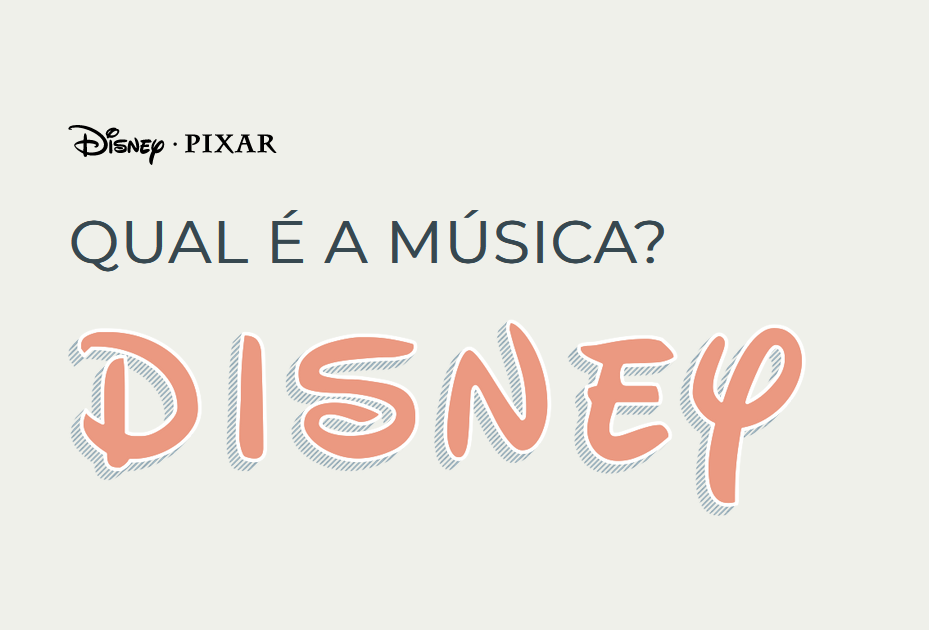

<!-- PROJECT LOGO -->
<br />
<div align="center">
    
  </a>

  <h3 align="center">Qual é a Música? - Disney 2.0</h3>

  <p align="center">
    Projeto desenvolvido durante o curso de Informática para Internet 
    <br />
    <a href="https://etecdarcypereirademoraes.com.br/"><strong>Etec Darcy Pereira de Moraes - Itapetininga »</strong></a>
    <br />
    <br />
    <a href="https://github.com/JuCDReis">Julia Reis</a>
    ·
    <a href="#">Ana Carolina Barros</a>

  </p>

</div>

<!-- ABOUT THE PROJECT -->
## Sobre o Projeto



Esse projeto foi desenvolvido na disciplina **Interfaces Web II**, para aplicar o uso de API's e aprimorar habilidades de Java Script. Ele consiste em um jogo que reproduz músicas de animações da disney, e o jogador deve acertar de qual filme a música foi tirada.

### O jogo funciona da seguinte forma:

* O jogador escohe um nickname (apelido), e inicia o jogo ao pertar o botão *play*.

* A música tocará por 5 segundos com o acerto valendo 15 pontos
 -- *Se necessário, o botão de play pode ser acionado novamente, e o acerto **vale 5 pontos a menos.***

* Se acertar a resposta, os pontos são adicionados ao score (exibido no canto direito superior da tela), e a próxima música é tocada. 

* Se errar -5 pontos são retirados do score,e a próxima música é tocada.

* O jogo termina quando o jogador **erra 3 vezes**, ou o total de músicas é tocado.

Ao final, o jogador é levado a uma página de ranking, onde é exibido o score final, e o ranking de todos os jogadores que jogaram no dispositivo.

<a href="https://jucdreis.github.io/disney-musicas/"><strong>Acesse o jogo online »</strong></a>


### Feito com

* HTML
* CSS
* Java Script

O projeto inical desenvolvido em aula utilizava a **API *Web Playback SDK* da Spotify**, que permite a reprodução de músicas em um site. 
<a href="https://github.com/KingJuu/disney-musicas"><strong>Acesse a versão 1.0 com o uso da API »</strong></a>

A versão 2.0 apresenta uma opção com as músicas hospedadas localmente, permitindo a modificação facilitada da playlist e o uso Offline do jogo.


<!-- GETTING STARTED -->
## Como começar

Para instalar e utilizar o jogo localmente, basta fazer o download desse repositório e fazer modificações se desejado.

### Instalação

_O download pode ser feito diretmente da página do github, ou clonado localmente utilizando o comando git abaixo_

   ```sh
   git clone https://github.com/JuCDReis/disney-musicas.git
   ```


<!-- CONTRIBUTING -->
## Contribuições

As constribuições são o que torna a comunidade open source tão especial. Suas constribuições serão **muito apreciadas**.

Se tiver alguma cugestão para melhora esse projeto, fork esse repositório e crie um pull request. Muito Obrigada!

1. Fork o projeto
2. Crie uma nova branch (`git checkout -b feature/AmazingFeature`)
3. Faça o commit de suas modificações (`git commit -m 'Add some AmazingFeature'`)
4. Push para a Branch (`git push origin feature/AmazingFeature`)
5. E faça um Pull Request


<!-- CONTACT -->
## Contato

Julia Reis - reisjulia.dev@gmail.com

Link do Projeto: [https://github.com/JuCDReis/disney-musicas](https://github.com/JuCDReis/disney-musicas)


_Desenvolvido por Julia Reis e Ana Carolina Barros, 2024._
